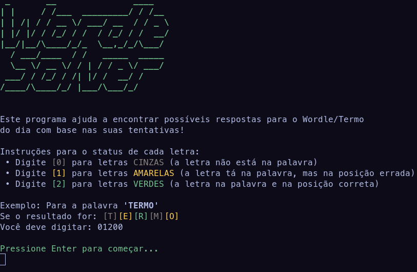
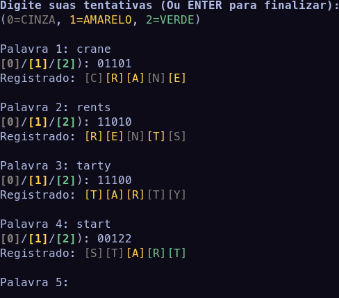
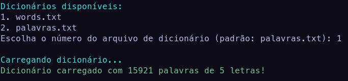
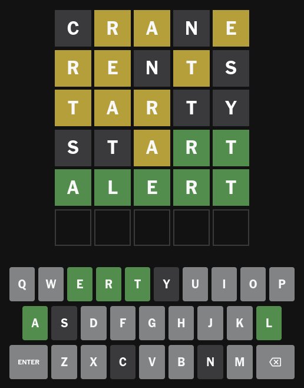

# Wordle Solver



Um programinha em Python para ajudar você a resolver o [Termo](https://term.ooo/) ou o [Wordle](https://www.nytimes.com/games/wordle/index.html) do dia!

Inspirado no vídeo:
<https://www.youtube.com/watch?v=788nz5_Rzwg>

O dicionário em português pode ser acessado em:
<https://www.ime.usp.br/~pf/dicios/>

## Instalação

Para instalar e rodar o Wordle Solver, você precisará ter o Git e o Python versão 3.10+ instalado no seu sistema

```bash
> git clone https://github.com/ahvShiro/wordle-checker.git
> cd wordle-solver/src
> python3 main.py
```

## Como usar?

Ao rodar `python3 main.py`, siga as instruções do programa:

- Insira a palavra que você tentou colocar no Wordle/Termo
- Insira a cor de cada letra da tentativa seguindo o esquema do programa:
  - 0 para cinza (letras que não estão na palavra (em cinza)
  - 1 para amarelo (letras que estão na palavra, mas na posição errada)
  - 2 para verde (letras que estão na posição certa)
- Digite o nome do dicionário localizado em `/data/`. Os dicionários disponíveis no repositório por padrão são palavras.txt em português e words.txt em inglês. (Sinta-se livre para adicionar dicionários de outras línguas!)
- O programa irá automaticamente informar quais palavras no dicionário da lingua portuguesa se encaixam no termo!

## Prints

Usuário inserindo suas tentativas:



Seleção de dicionários:



Restrições definidas e palavras encontradas pelo programa:


Resultado do Wordle do dia (06/03/2025):


